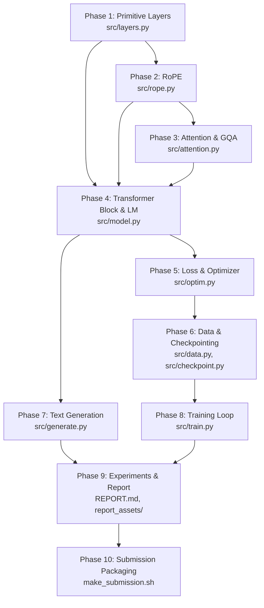

# CS 5326 PA1: The Modern Transformer LM — Comprehensive Implementation Guide

This guide details the complete blueprint for implementing, testing, training, evaluating, and submitting Assignment 1.

---

## 1. Architectural Blueprint & Constraints

### 1.1 Forbidden Abstractions & Low-Level Rules
All modules must be built from first principles using raw PyTorch tensor operations.

* **Forbidden Modules**: `torch.nn.Linear`, `torch.nn.Embedding`, `torch.nn.RMSNorm`, `torch.nn.SiLU`, `torch.nn.MultiheadAttention`, `torch.nn.Transformer*`.
* **Forbidden Functions**: `torch.nn.functional.linear`, `embedding`, `rms_norm`, `silu`, `softmax`, `log_softmax`, `cross_entropy`, `scaled_dot_product_attention`, `torch.nn.utils.clip_grad_norm_`, `torch.softmax`, `torch.log_softmax`.
* **Forbidden Optimizers**: `torch.optim.Adam`, `torch.optim.AdamW`.
* **Permitted Abstractions**:
  * `torch.nn.Parameter`, `torch.nn.Module`, `torch.nn.ModuleList`, `torch.nn.Sequential`
  * `torch.nn.init.trunc_normal_`
  * `torch.optim.Optimizer` base class
  * `torch.sigmoid`, `torch.logsumexp`, `torch.multinomial`
  * `einops.rearrange`, `einops.einsum`

### 1.2 Target Model Architecture Specifications
The target 19M-parameter model uses fixed hyperparameters:

| Parameter | Symbol / Variable | Value | Notes |
| :--- | :--- | :--- | :--- |
| **Vocabulary Size** | $\|V\|$ / `vocab_size` | 8,192 | Byte-level BPE |
| **Context Length** | $n_{\max}$ / `context_length` | 256 | Max sequence length |
| **Residual Dimension** | $d_{\text{model}}$ | 512 | Hidden size |
| **Transformer Blocks** | $L$ / `num_layers` | 4 | Pre-norm blocks |
| **Query Heads** | $h_q$ / `n_q_heads` | 16 | Attention heads |
| **KV Heads** | $h_{kv}$ / `n_kv_heads` | 4 | Grouped-Query Attention (GQA) |
| **Group Size** | $g = h_q / h_{kv}$ | 4 | Query heads per KV head |
| **Head Dimension** | $d_h = d_{\text{model}} / h_q$ | 32 | Dimension per head |
| **SwiGLU Dimension** | $d_{ff}$ | 1,344 | Inner MLP dimension |
| **RoPE Theta** | $\Theta$ / `rope_theta` | 10,000 | Frequency base |
| **RMSNorm Epsilon** | $\epsilon_{\text{norm}}$ | $10^{-5}$ | Numerical stability constant |
| **Total Parameters** | — | **19,272,192** | Untied token embedding & LM head |

---

## 2. Implementation Roadmap by Module



---

### Phase 1: Primitive Layers (`src/layers.py`)

#### 1. `Linear`
* **Interface**: `__init__(self, in_features: int, out_features: int, device=None, dtype=None)`
* **Parameters**: `self.weight = nn.Parameter(torch.empty((out_features, in_features), device=device, dtype=dtype))`
* **Initialization**: Truncated normal $\mathcal{N}(0, \sigma^2 = \frac{2}{d_{in} + d_{out}})$ clipped to $[-3\sigma, 3\sigma]$ using:
  ```python
  std = (2.0 / (in_features + out_features)) ** 0.5
  torch.nn.init.trunc_normal_(self.weight, mean=0.0, std=std, a=-3.0 * std, b=3.0 * std)
  ```
* **Forward**: $y = x W^T$. Compute via `torch.matmul(x, self.weight.t())` or einsum. No bias!
* **Adapter**: `run_linear` in `tests/adapters.py`.

#### 2. `Embedding`
* **Interface**: `__init__(self, num_embeddings: int, embedding_dim: int, device=None, dtype=None)`
* **Parameters**: `self.weight = nn.Parameter(torch.empty((num_embeddings, embedding_dim), device=device, dtype=dtype))`
* **Initialization**: Truncated normal $\mathcal{N}(0, 1)$ clipped to $[-3, 3]$ using `torch.nn.init.trunc_normal_(self.weight, mean=0.0, std=1.0, a=-3.0, b=3.0)`.
* **Forward**: `return self.weight[token_ids]`. Direct tensor indexing preserves differentiability.
* **Adapter**: `run_embedding`.

#### 3. `RMSNorm`
* **Interface**: `__init__(self, d_model: int, norm_eps: float = 1e-5, device=None, dtype=None)`
* **Parameters**: Gain vector `self.weight = nn.Parameter(torch.ones(d_model, device=device, dtype=dtype))`.
* **Forward**:
  * Check input dtype: if `torch.float16` or `torch.bfloat16`, cast to `torch.float32`. If `float32` or `float64`, preserve that precision.
  * Compute RMS: $\text{RMS}(x) = \sqrt{\frac{1}{d} \sum_{c=1}^d x_c^2 + \epsilon_{\text{norm}}} = \sqrt{\text{mean}(x^2, \text{dim}=-1, \text{keepdim}=\text{True}) + \epsilon_{\text{norm}}}$.
  * Compute normalized output: $\gamma \odot \frac{x}{\text{RMS}(x)}$.
  * Cast back to original `x.dtype`.
* **Adapter**: `run_rmsnorm`.

#### 4. `silu` and `SwiGLU`
* **SiLU**: $\text{SiLU}(x) = x \cdot \sigma(x) = x \cdot \text{torch.sigmoid}(x)$.
* **SwiGLU**:
  * Three bias-free Linear layers: `gate_proj` ($d_{\text{model}} \to d_{ff}$), `up_proj` ($d_{\text{model}} \to d_{ff}$), and `down_proj` ($d_{ff} \to d_{\text{model}}$).
  * Forward: $\text{SwiGLU}(x) = W_{\text{down}}(\text{SiLU}(W_{\text{gate}} x) \odot W_{\text{up}} x)$.
* **Adapters**: `run_silu`, `run_swiglu`.

---

### Phase 2: Rotary Positional Embeddings (`src/rope.py`)

#### `RotaryPositionalEmbedding`
* **Interface**: `__init__(self, rope_theta: float, head_dim: int, context_length: int, device=None)`
* **Validation**: Reject odd `head_dim` (`if head_dim % 2 != 0: raise ValueError(...)`).
* **Precomputed Frequency Tables**:
  * For $k \in \{0, \dots, \frac{d_h}{2} - 1\}$: $\omega_k = \Theta^{-\frac{2k}{d_h}}$.
  * For positions $i \in \{0, \dots, n_{\max} - 1\}$: $\phi_{i, k} = i \cdot \omega_k$.
  * Store $\cos(\phi)$ and $\sin(\phi)$ in non-persistent buffers of shape `[context_length, head_dim // 2]`:
    ```python
    self.register_buffer("cos_cached", torch.cos(phi), persistent=False)
    self.register_buffer("sin_cached", torch.sin(phi), persistent=False)
    ```
* **Adjacent-Pair Rotation Formula**:
  * Adjacent-pair quarter turn: $\text{rotate\_pair}(x) = (-x_2, x_1, -x_4, x_3, \dots, -x_{d_h}, x_{d_h-1})$.
  * Implemented cleanly by reshaping $x$ into `[..., head_dim // 2, 2]`, slicing $x_1, x_2$, concatenating $(-x_2, x_1)$, and flattening back.
  * Broadcast `cos` and `sin` over pairs:
    $$R_i x = x \odot c_i + \text{rotate\_pair}(x) \odot s_i$$
* **Forward Validation**:
  * Verify `x.shape[-1] == head_dim`.
  * Verify `token_positions` is integer type and all entries satisfy $0 \le \text{pos} < \text{context\_length}$.
* **Adapter**: `run_rope`.

---

### Phase 3: Attention Mechanism (`src/attention.py`)

#### 1. `softmax(x, dim)`
* Numerically stable: $\hat{x} = x - \max_{c}(x)$ (with `keepdim=True`).
* $\text{softmax}(x) = \frac{\exp(\hat{x})}{\sum_c \exp(\hat{x})}$.
* **Adapter**: `run_softmax`.

#### 2. `scaled_dot_product_attention(q, k, v, mask=None)`
* Scores: $S = \frac{Q K^T}{\sqrt{d_k}}$.
* Masking: Optional boolean mask where `True` is unmasked and `False` is masked.
  * Where mask is `False`, set score to $-\infty$.
  * Validation: verify each query row has at least one valid key; raise `ValueError` if any query is completely masked out.
* Attention weights: $A = \text{softmax}(S, \text{dim}=-1)$.
* Output: $A V$.
* **Adapter**: `run_scaled_dot_product_attention`.

#### 3. `CausalGroupedQueryAttention`
* Projections:
  * $W_Q \in \mathbb{R}^{(h_q \cdot d_h) \times d_{\text{model}}}$
  * $W_K \in \mathbb{R}^{(h_{kv} \cdot d_h) \times d_{\text{model}}}$
  * $W_V \in \mathbb{R}^{(h_{kv} \cdot d_h) \times d_{\text{model}}}$
  * $W_O \in \mathbb{R}^{d_{\text{model}} \times (h_q \cdot d_h)}$
* Grouped Layout:
  * Reshape $Q$ to `[B, h_kv, g, n, d_h]` where $g = h_q / h_{kv}$.
  * Reshape $K, V$ to `[B, h_kv, n, d_h]`.
* Apply RoPE to $Q$ and $K$ using token positions (defaults to $0, \dots, n-1$).
* Attention contraction without materializing KV repeats:
  * Compute scaled dot product between $Q$ `[B, h_kv, g, n, d_h]` and $K$ `[B, h_kv, n, d_h]`.
  * Causal mask: $j \le i$. Mask invalid entries with $-\infty$.
  * Softmax over $j$.
  * Multiply with $V$ `[B, h_kv, n, d_h]` $\to$ `[B, h_kv, g, n, d_h]`.
* Merge heads back preserving $a = (h - 1)g + r \to$ `[B, n, d_model]`, then project with $W_O$.
* **Adapter**: `run_grouped_query_self_attention`.

---

### Phase 4: Transformer Block & Full LM (`src/model.py`)

#### 1. `TransformerBlock`
* Sublayers:
  * Attention with RMSNorm:
    $$u = x + \text{Attention}(\text{RMSNorm}_{\text{attn}}(x), \text{token\_positions})$$
  * FFN with RMSNorm:
    $$y = u + \text{SwiGLU}(\text{RMSNorm}_{\text{ffn}}(u))$$
* Two separate RMSNorm modules with distinct parameters.
* **Adapter**: `run_transformer_block`.

#### 2. `TransformerLM`
* Modules:
  * `token_embedding`: `Embedding(vocab_size, d_model)`
  * `blocks`: `nn.ModuleList([TransformerBlock(...) for _ in range(num_layers)])`
  * `final_norm`: `RMSNorm(d_model, norm_eps)`
  * `lm_head`: `Linear(d_model, vocab_size)` (untied weights!)
* Forward validation:
  * Sequence length $n$: $1 \le n \le \text{context\_length}$.
  * Token positions: broadcastable to input batch dimensions.
* Attributes: expose `self.context_length`.
* **Adapters**: `run_transformer_lm`, `get_transformer_lm`.

---

### Phase 5: Loss & Optimizer (`src/optim.py`)

#### 1. `cross_entropy(logits, targets)`
* Logits: `[..., vocab_size]`, Targets: `[...]`.
* Numerically stable log-sum-exp with max subtraction:
  $$\ell = -\hat{z}_{\text{target}} + \log \sum_{c} \exp(\hat{z}_c)$$
* Return scalar mean over all batch and sequence positions.
* **Adapter**: `run_cross_entropy`.

#### 2. `AdamW(torch.optim.Optimizer)`
* Constructor validation: $lr \ge 0$, $\epsilon \ge 0$, $\lambda \ge 0$, $0 \le \beta_1 < 1$, $0 \le \beta_2 < 1$.
* Re-validate effective values in param groups inside `step()`.
* Per-parameter state:
  * Lazy initialization of `step = 0`, `exp_avg = torch.zeros_like(p)`, `exp_avg_sq = torch.zeros_like(p)`.
  * Increment step $t_p \leftarrow t_p + 1$ only when gradient is present.
  * Skip parameters where `p.grad is None`.
  * Reject sparse gradients.
* Updates:
  1. $m_{t} \leftarrow \beta_1 m_{t-1} + (1 - \beta_1) g_t$
  2. $v_{t} \leftarrow \beta_2 v_{t-1} + (1 - \beta_2) (g_t \odot g_t)$
  3. $\hat{m}_{t} \leftarrow \frac{m_{t}}{1 - \beta_1^{t_p}}$, $\hat{v}_{t} \leftarrow \frac{v_{t}}{1 - \beta_2^{t_p}}$
  4. Decoupled weight decay: $p \leftarrow (1 - \alpha \lambda) p$
  5. Adaptive update: $p \leftarrow p - \alpha \frac{\hat{m}_t}{\sqrt{\hat{v}_t} + \epsilon}$
* Handle `closure` when provided.
* **Adapter**: `get_adamw_cls`.

#### 3. `get_lr_cosine_schedule(step, lr_max, lr_min, warmup_steps, cosine_steps)`
* Validation: $s \ge 0$, $0 \le \alpha_{\min} \le \alpha_{\max}$, $0 \le s_w < s_c$.
* Schedule:
  * If $s < s_w$: $\alpha_s = \frac{s}{s_w} \alpha_{\max}$.
  * If $s_w \le s \le s_c$: $\alpha_s = \alpha_{\min} + \frac{1}{2}\left(1 + \cos\left(\pi \frac{s - s_w}{s_c - s_w}\right)\right)(\alpha_{\max} - \alpha_{\min})$.
  * If $s > s_c$: $\alpha_s = \alpha_{\min}$.
* **Adapter**: `run_get_lr_cosine_schedule`.

#### 4. `gradient_clipping(parameters, max_l2_norm)`
* Validation: `max_l2_norm > 0`.
* Global norm: $\|g\|_2 = \sqrt{\sum_p \sum_i (g_i^{(p)})^2}$.
* If $\|g\|_2 > M$: scale gradients by $\frac{M}{\|g\|_2 + 10^{-6}}$ in-place.
* Return pre-clipping norm as `float`.
* **Adapter**: `run_gradient_clipping`.

---

### Phase 6: Data Loader & Checkpointing (`src/data.py`, `src/checkpoint.py`)

#### 1. `load_token_array(path)`
* Verify path exists and file size is even.
* Open using `np.memmap(path, mode="r", dtype=np.dtype("<u2"))`.
* **Adapter**: `run_load_token_array`.

#### 2. `get_batch(dataset, batch_size, sequence_length, device, generator)`
* Sample starting offsets uniformly from $[0, \text{len}(dataset) - \text{sequence\_length})$ using `generator`.
* Slices: inputs $x = [o, o + n]$, targets $y = [o + 1, o + n + 1]$.
* Convert small sampled batch to `torch.long` and move to `device`.
* **Adapter**: `run_get_batch`.

#### 3. Checkpointing (`save_checkpoint`, `load_checkpoint`)
* Save: dictionary containing `model` state dict, `optimizer` state dict, `next_step` ($= step + 1$), `train_generator` RNG state, and `val_generator` RNG state.
* Load: restore model, optimizer, both generator states with `set_state()`, and return `next_step`.
* **Adapters**: `run_save_checkpoint`, `run_load_checkpoint`.

---

### Phase 7: Text Generation (`src/generate.py`)

#### `generate(model, prompt_ids, max_new_tokens, context_length, ...)`
* Validation: `max_new_tokens >= 0`, `context_length == model.context_length`, $\tau > 0$, $0 < p \le 1$.
* Save model mode, switch to `model.eval()`, run in `torch.inference_mode()`.
* Autoregressive loop:
  1. Crop sequence to last `context_length` tokens.
  2. Forward pass $\to$ select logits at final position.
  3. Divide logits by temperature $\tau$.
  4. Apply numerically stable softmax.
  5. Top-$p$ nucleus filtering:
     * Sort probabilities descending.
     * Retain shortest prefix whose cumulative sum reaches or exceeds $p$.
     * Zero remaining entries and renormalize.
  6. Sample next token with `torch.multinomial(..., generator=generator)`.
  7. Check for `eot_token_id`: stop immediately if generated.
* Restore model training mode before returning.

---

### Phase 8: Training Script (`src/train.py`)

#### Canonical Execution Order
Follow the required sequence per optimization update $s$:
1. Set model to train mode: `model.train()`.
2. Compute $\alpha_s = \text{get\_lr}(s, \dots)$ and set in all param groups.
3. Zero gradients: `optimizer.zero_grad()`.
4. Accumulate over $n_{\text{acc}} = 16$ microbatches:
   * Sample microbatch $(x, y)$.
   * Forward pass $\to \text{loss} = \text{cross\_entropy}(\text{logits}, y)$.
   * Backward pass: `(loss / n_acc).backward()`.
5. Global gradient clipping: `grad_norm = gradient_clipping(model.parameters(), max_norm=1.0)`.
6. Optimizer step: `optimizer.step()`.
7. Step bookkeeping: `completed_steps = s + 1`.
8. Validation (if due): evaluate cross-entropy over validation batches in `torch.inference_mode()`.
9. Logging (if due): log step, train loss, val loss, lr, grad norm.
10. Checkpointing (if due): save full training checkpoint.
11. Final export: save FP16 CPU state dict as `final_model.pt`.

---

## 3. Testing & Verification Checklist

Run unit tests systematically as components are built:

```bash
# Data loading
uv run pytest tests/test_data.py

# Primitive layers
uv run pytest tests/test_layers.py

# RoPE
uv run pytest tests/test_rope.py

# Scaled dot-product attention and GQA
uv run pytest tests/test_attention.py

# Full Transformer block and LM
uv run pytest tests/test_model.py

# Cross-entropy, AdamW, scheduler, and gradient clipping
uv run pytest tests/test_optim.py

# Checkpointing round-trip
uv run pytest tests/test_checkpoint.py

# AST-based code restriction checks
uv run pytest tests/test_restrictions.py

# Full test suite
uv run pytest
```

---

## 4. Final Deliverables & Packaging

1. **`final_model.pt`**: FP16 CPU state dict of the trained model with exactly 19,272,192 parameters:
   ```python
   state = {
       name: tensor.detach().cpu().to(torch.float16)
       if tensor.is_floating_point()
       else tensor.detach().cpu()
       for name, tensor in model.state_dict().items()
   }
   torch.save(state, "final_model.pt")
   ```
2. **`REPORT.md`**: Fill out all 4 sections with experimental reasoning, final validation loss/perplexity, and decoding comparisons.
3. **`report_assets/`**: Include plots (loss curves, learning rate trajectory, etc.) referenced in `REPORT.md`.
4. **Submission**:
   ```bash
   bash make_submission.sh
   mv submission.zip <roll_number_pa1>.zip
   ```
